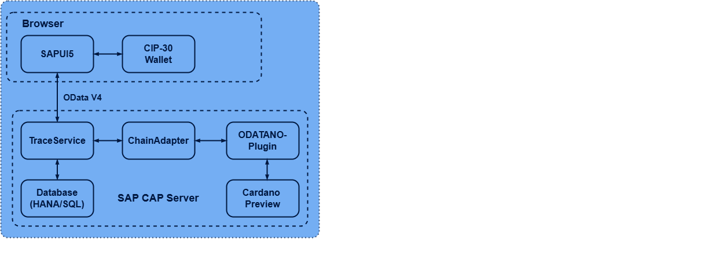

## Architecture



## Tech Stack

| Layer | Technology |
|-------|-----------|
| Smart Contracts | Aiken (Plutus V3) |
| Blockchain | Cardano preview testnet |
| Chain Gateway | @odatano/core v1.7.7 (CAP plugin) |
| Backend | SAP CAP v9, Node.js, TypeScript |
| Database | SQLite (dev), SAP HANA (prod) |
| Frontend | Freestyle SAPUI5 (OpenUI5 CDN, sap_horizon) |
| Signing | CIP-30 browser wallets (zero key custody) |

## Data Model

```
Participants (Manufacturer | Distributor | Pharmacy | Regulator)
     │
     ├──< Batches (DRAFT > MINTED > IN_TRANSIT > DELIVERED | RECALLED)
     │      │
     │      ├──< OnChainAssets   1:1  (policyId, assetName, UTxO ref, step)
     │      ├──< ProofEvents     1:N  (MINT, TRANSFER, VERIFY, DOCUMENT_ANCHOR)
     │      └──< DocumentAnchors 1:N  (doc hash, type, cold-chain temps)
```

## Project Structure

```
TRACE/
├── db/
│   ├── schema.cds         5 entities
│   └── data/              CSV seed data
├── srv/
│   ├── trace-service.cds  OData V4 service (8 actions + 1 function)
│   ├── trace-service.ts   Handler implementation
│   └── lib/
│       ├── chain-adapter.ts  ODATANO service wrapper
│       └── digest.ts         SHA-256 + canonicalization
├── contracts/
│   ├── validators/pharma_trace.ak  Aiken contract
│   └── plutus.json                 Compiled Plutus V3
├── app/trace/webapp/      SAPUI5 frontend
└── package.json
```
